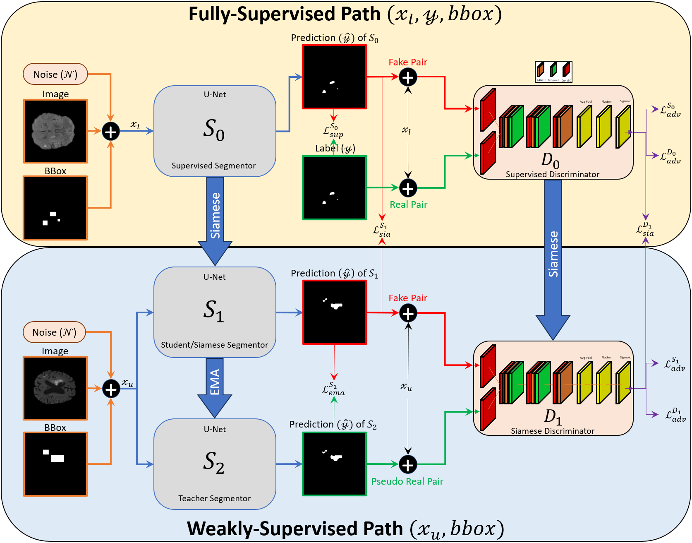

# TriGAN-SiaMT: A Triple-Segmentor Adversarial Network with Bounding Box Priors for Semi-Supervised Brain Lesion Segmentation



> This is an official implementation of [TriGAN-SiaMT: A triple-segmentor adversarial network with bounding box priors for semi-supervised brain lesion segmentation](https://www.sciencedirect.com/science/article/abs/pii/S0167865525003861?dgcid=coauthor) <br>

**Release date:** 14/Dec/2025

## Abstract
Accurate brain lesion segmentation from MRI is essential for clinical decision-making, yet dense pixel-wise annotations are expensive and limited. We propose TriGAN-SiaMT, a semi-supervised segmentation framework that integrates adversarial learning, multi-level consistency regularization, and bounding box priors. The model employs three segmentors with supervised, Siamese, and EMA-based teacher pathways to effectively leverage both labeled and unlabeled data. Experiments on ISLES 2022 and BraTS 2019 demonstrate strong performance and robustness under limited supervision.

## Usage

### Installation
The framework was tested using Python 3.10, PyTorch 2.6, and CUDA 12.4.

```
conda create -n trigan_siamt python=3.10
conda activate trigan_siamt
cd TriGAN-SiaMT
pip install -r requirements.txt
```

### Datasets
ISLES-2022 dataset can be downloaded from [Kaggle](https://www.kaggle.com/datasets/orvile/isles-2022-brain-stoke-dataset), and BraTS-2019 dataset from [Kaggle](https://www.kaggle.com/datasets/aryashah2k/brain-tumor-segmentation-brats-2019/data). <br>

After placing the downloaded 3D volumes in `data/DATASET/3d_data/`, generate 2D slices and patient-wise train/val/test splits using:
```bash
python make_dataset.py
```

Bounding box annotations are generated with:
```bash
python generate_bbox.py
```

```
data/
├─ isles22/
│  ├─ 3d_data/
│  ├─ images/
│  │  ├─ dwi/
│  │  │  ├─ train/
│  │  │  ├─ val/
│  │  │  └─ test/
│  │  └─ label/
│  │     ├─ train/
│  │     ├─ val/
│  │     └─ test/
│  └─ bboxes/
│     ├─ mask_bbox/
│     │  ├─ train/
│     │  ├─ val/
│     │  └─ test/
│     ├─ bbox_train.json
│     ├─ bbox_val.json
│     └─ bbox_test.json
├─ brats19/
│  └─ ...
```

### Training & Evaluation
```
python train.py
python evaluate.py
```

## Citation
If you find this work useful, please consider citing:

```bibtex
@article{ALSHURBAJI202637,
  title   = {TriGAN-SiaMT: A triple-segmentor adversarial network with bounding box priors for semi-supervised brain lesion segmentation},
  journal = {Pattern Recognition Letters},
  volume  = {200},
  pages   = {37--43},
  year    = {2026},
  issn    = {0167-8655},
  doi     = {https://doi.org/10.1016/j.patrec.2025.11.032},
  url     = {https://www.sciencedirect.com/science/article/pii/S0167865525003861},
  author  = {Mohammad Alshurbaji and Maregu Assefa and Ahmad Obeid and Mohamed L. Seghier and Taimur Hassan and Kamal Taha and Naoufel Werghi}
}
```

## Acknowledgements
Parts of this implementation build upon components from [SSL4MIS](https://github.com/HiLab-git/SSL4MIS). We thank the authors for making their work publicly available.

